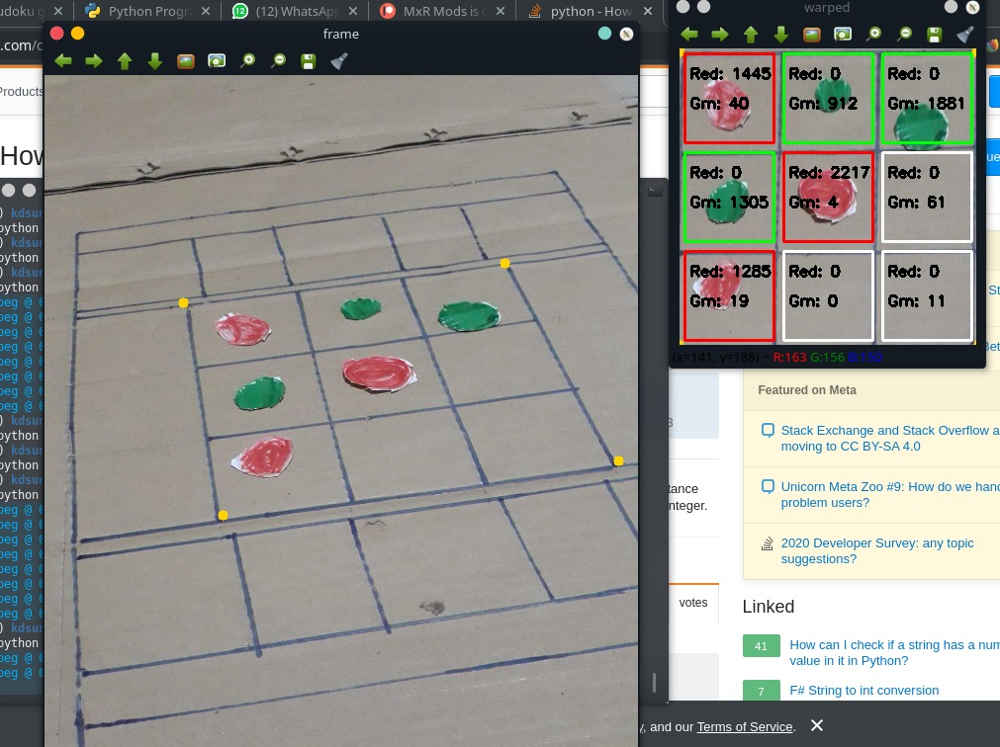

# XOBot

## Image Processing

### Steps

The steps taken to process a image is as follows,

- Mark 4 points of the corners of the board manually
- Resize image to a smaller size (`800x600` currently)
- Warp perspective to the marked corners
- Apply red and green masks and count red and green pixels inside a square
- Apply a threshold to detect if a square is red or green (current threshold 500 pixels)

### Screenshot

